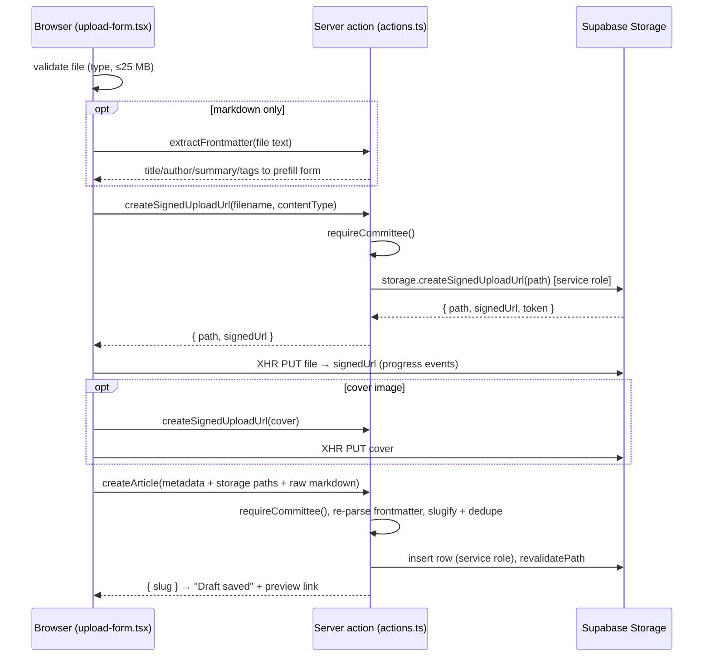

# The Articles feature

This document explains the Articles system well enough to extend and debug it without re-reading every file. It assumes you know Next.js App Router basics and have seen the EMN codebase before.

## Table of contents

1. [Overview](#1-overview)
2. [Route map](#2-route-map)
3. [Data model](#3-data-model)
4. [Security model](#4-security-model)
5. [Upload pipeline](#5-upload-pipeline)
6. [Rendering pipeline](#6-rendering-pipeline)
7. [Typography system](#7-typography-system)
8. [File-by-file map](#8-file-by-file-map)
9. [Environment variables](#9-environment-variables)
10. [Setup checklist](#10-setup-checklist)
11. [Known limitations](#11-known-limitations)
12. [How to extend](#12-how-to-extend)
13. [If something breaks, check these first](#if-something-breaks-check-these-first)

---

## 1. Overview

Articles are long-form pieces (research, primers, commentary) published by the club. There are two experiences:

- **Public readers** browse `/articles` (searchable, filterable card grid) and read individual pieces at `/articles/<slug>`. Only published articles are visible.
- **Committee members** (member rows with `role` of `committee` or `admin`) use `/articles/admin` to upload files, edit metadata, preview drafts, publish/unpublish, and delete.

Articles arrive in two source formats and are treated differently end to end:

- **Markdown** (`.md`) is parsed on the server and rendered as native HTML in EMN typography. The body lives in the database (`content_md`) for fast reads; the original file also goes to Storage as the source of record.
- **PDF** is stored in Storage and served through an embedded viewer wrapped in EMN page chrome. The PDF's own typography cannot be changed (see [Known limitations](#11-known-limitations)).

## 2. Route map

| Route | Who | Rendering |
| --- | --- | --- |
| `/articles` | public | Dynamic (reads `searchParams` for search/tag/page) |
| `/articles/[slug]` | public (published) / committee (drafts) | ISR, `revalidate = 3600`; draft previews render dynamically because they touch the session |
| `/articles/admin` | committee/admin only; others are redirected to `/articles` | Dynamic (session) |

`loading.tsx` (index skeleton) and `error.tsx` (retry UI) cover the `/articles` segment; `not-found.tsx` covers unknown or unpublished slugs.

Publish/unpublish/edit/delete all call `revalidatePath`, so the hour-long ISR window never delays a deliberate change — it only bounds how stale a page can get if Supabase data is changed behind the app's back.

## 3. Data model

One table, `public.articles` (`supabase/migrations/20260718000000_articles.sql`):

```sql
create table public.articles (
  id             uuid primary key default gen_random_uuid(),
  slug           text not null unique,
  title          text not null,
  subtitle       text,
  author         text not null,
  summary        text,
  tags           text[] not null default '{}',
  cover_path     text,
  source_type    text not null check (source_type in ('markdown', 'pdf')),
  storage_path   text,          -- object key in the 'articles' storage bucket
  content_md     text,          -- markdown body; null for PDF articles
  reading_minutes integer,
  status         text not null default 'draft' check (status in ('draft', 'published')),
  published_at   timestamptz,
  created_at     timestamptz not null default now(),
  updated_at     timestamptz not null default now(),
  created_by     text
);
```

Column by column:

- **`slug`** — the public URL. Generated from the title (`app/lib/articles/slug.ts`), unique-suffixed on collision (`-2`, `-3`, …), editable while draft, frozen after first publish so shared links never break.
- **`title` / `subtitle` / `author` / `summary`** — display metadata. `summary` feeds the card grid, search, and OG description.
- **`tags`** — Postgres `text[]`; the index filter uses PostgREST `contains`. No tag table: tags are folksonomy, not taxonomy, and a join table buys nothing at this scale.
- **`cover_path`** — Storage object key (not a URL — the bucket is private, URLs are minted per-request).
- **`source_type`** — the branch point for the whole rendering pipeline: `markdown` renders `content_md`; `pdf` embeds the file at `storage_path`.
- **`storage_path`** — Storage key of the uploaded file. Set for both types: for markdown it is the original upload (source of record, re-downloadable exactly as uploaded).
- **`content_md`** — markdown body with frontmatter stripped, stored in the row so reads don't need a Storage round-trip. Null for PDFs.
- **`reading_minutes`** — computed at upload (`words / 200`, minimum 1). Null for PDFs — page count isn't reading time.
- **`status` / `published_at`** — the visibility gate and sort key. First publish stamps `published_at`; unpublish keeps it, so republishing doesn't reshuffle ordering. The composite index `(status, published_at desc)` matches the only hot query.
- **`created_at` / `updated_at`** — `updated_at` is maintained by a trigger (`set_articles_updated_at`), not by application code.
- **`created_by`** — email of the uploader, for audit; free text on purpose (members can be deleted).

The migration also adds `role` to `public.members` and creates the private `articles` storage bucket.

## 4. Security model

The single most important fact: **auth is NextAuth, not Supabase Auth.** Users sign in via magic-link email; their session lives in the `next_auth` schema. Supabase never issues them a JWT, so inside Postgres `auth.uid()` is always null. Any RLS policy written against `auth.uid()` would silently deny (or worse, be rewritten to `true` by a future dev who "fixes" it). So the model is split:

**Reads** go through RLS. The anon key is used for all public reads (`app/lib/supabase-client.ts`, consumed server-side by `app/lib/articles/queries.ts`), and the only policy on the table is:

```sql
create policy "Published articles are readable by everyone"
  on public.articles
  for select
  to anon, authenticated
  using (status = 'published');
```

Even if a query in `queries.ts` forgets a `.eq("status", "published")`, RLS returns nothing it shouldn't.

**Writes** have no policies at all — an insert/update/delete with the anon key fails outright. Every mutation goes through a server action in `app/articles/actions.ts` that uses the service-role client (`app/lib/supabase-server.ts`), which bypasses RLS, and is gated first:

```ts
export async function deleteArticle(id: string): Promise<ActionResult<undefined>> {
  try {
    await requireCommittee();
  } catch {
    return fail("You need committee access to delete articles.");
  }
  // ... service-role mutation
```

The role check lives in one file, `app/lib/require-committee.ts`:

```ts
export async function getCommitteeSession(): Promise<Session | null> {
  const session = await getServerSession(authOptions);
  const role = session?.user?.role;
  if (!session?.user?.email) return null;
  if (role !== "committee" && role !== "admin") return null;
  return session;
}
```

The role reaches the session via the existing `session` callback in `app/lib/auth.ts` (this app uses **database sessions**, so there is no `jwt` callback — the callback already fetched the member row by email; it now also selects `role`).

Why the check happens in more than one place: the admin **page** checks so non-committee users get redirected (UX), and every **action** checks again because server actions are plain HTTP endpoints — anyone can invoke them directly with curl, never having loaded the page. The page-level check is convenience; the action-level check is the boundary. There is deliberately no middleware: middleware can be bypassed by design changes (matcher gaps, rewrites) and must never be the thing standing between an anonymous request and a service-role write.

The service-role key itself only appears in `app/lib/supabase-server.ts`, which begins with `import "server-only"` — the build fails if any client component ever pulls it in transitively.

## 5. Upload pipeline

Files never pass through the Next.js server. Vercel serverless functions reject request bodies over ~4.5 MB, and article PDFs routinely exceed that, so the browser uploads straight to Supabase Storage using a one-shot signed upload URL minted by a committee-gated action.



Notes:

- The signed URL authorises exactly one object key for a short window; possessing it doesn't grant anything else. That's why it's safe to hand to the browser.
- The upload is a raw `XMLHttpRequest` PUT (see `putWithProgress` in `upload-form.tsx`) rather than supabase-js's `uploadToSignedUrl`, because fetch-based clients cannot report upload progress and the brief for this feature required a real progress bar.
- `createArticle` re-parses the markdown server-side with `gray-matter` rather than trusting the client's prefill — the row's `content_md` always reflects the actual file.
- Everything lands as a **draft**. Publishing is a separate, deliberate action in the admin table.

## 6. Rendering pipeline

**Markdown** (`app/components/articles/markdown-body.tsx`, a server component):

```tsx
<div className="prose prose-emn mx-auto">
  <ReactMarkdown
    remarkPlugins={[remarkGfm]}
    rehypePlugins={[rehypeSanitize]}
  >
    {content}
  </ReactMarkdown>
</div>
```

Parse (`react-markdown` + `remark-gfm` for tables/strikethrough/task lists) → sanitise (`rehype-sanitize`, default schema) → style (`prose prose-emn`, defined in `tailwind.config.ts`). Sanitisation stays on even though only committee members upload: a committee member's laptop can be compromised, a markdown file can be copy-pasted from anywhere, and stored XSS on a club site is a bad afternoon. All of this happens on the server; the client receives finished HTML.

**PDF** (`app/components/articles/pdf-reader.tsx`, client component): the EMN chrome — title, byline, tags, back link, download button — is normal page markup in EMN fonts. The document itself is an `<object type="application/pdf">` with an `<iframe>` fallback and a download link as the final fallback. On viewports under 768px the embed is skipped entirely for a prominent "Open PDF" button, because iOS Safari renders inline PDF embeds as a single frozen page. What you cannot do is restyle the PDF's body text: **a PDF's typography is baked into the file.** If the club ever wants page-by-page custom rendering (thumbnails, EMN-styled controls), `react-pdf` (pdf.js) is the upgrade path — it wasn't the default because it needs worker-file configuration under Next 15 and adds ~300 KB for something `<object>` does for free.

## 7. Typography system

Before this change, `font-candu` was silently broken: `next/font/local` registers the font under a *hashed* family name, and `globals.css` declared `.font-candu { font-family: 'Candu', sans-serif; }` against the literal name — plus the `candu` export was never applied anywhere. Every Candu heading was actually the system sans.

Now the chain is: `app/ui/fonts.ts` exposes CSS variables →

```ts
export const candu = Candu({
    src: '../../public/fonts/Candu.woff2',
    display: 'swap',
    variable: '--font-candu',
    });
```

→ `layout.tsx` puts both variable classes on `<body>` → `tailwind.config.ts` defines the tokens:

```ts
fontFamily: {
  candu: ["var(--font-candu)", "sans-serif"],
  sans: ["var(--font-schibsted)", "ui-sans-serif", "system-ui", "sans-serif"],
},
```

Tailwind now generates the `font-candu` utility itself, so the hundreds of existing `font-candu` usages needed no edits — they just started resolving correctly.

**To swap Candu for an OFL alternative** (its licence for organisational use is unresolved; Nunito, Baloo 2 and Grandstander are the candidates): change the `src` in `fonts.ts` — or replace the `next/font/local` call with a `next/font/google` one keeping `variable: '--font-candu'`. Nothing else changes anywhere.

Article-body reading typography is the `emn` key under `typography` in `tailwind.config.ts`: h1/h2 in Candu caps with tight leading, h3+ in Schibsted semibold (Candu is a display face and gets heavy at subheading sizes), 18px body at `leading-relaxed`-equivalent with measure capped at 68ch, `emn-green` underlined links, green-bordered blockquotes, mono code on a subtle background.

Related: the brand green was inconsistent (`#6cbe45` in the logo, `#6ebf46` in the Tailwind token). The token — and its mirror in `button.tsx` — now match the logo: `#6cbe45`.

## 8. File-by-file map

Added:

- `supabase/migrations/20260718000000_articles.sql` — table, index, trigger, RLS, `members.role`, bucket.
- `supabase/fixtures/` — seed SQL plus one markdown and one generated PDF fixture.
- `types/article.ts` — `Article`, `ArticleListItem` (list projection without `content_md`), `ArticleInput`, `MemberRole`.
- `app/lib/supabase-client.ts` — lazy anon-key client.
- `app/lib/require-committee.ts` — the committee gate (see §4).
- `app/lib/articles/slug.ts` — `slugify` + `makeUniqueSlug`.
- `app/lib/articles/queries.ts` — typed reads: public (anon key) and committee (service role), plus `getSignedFileUrl`.
- `app/articles/page.tsx` — public index: search, tag filter, pagination, empty state.
- `app/articles/[slug]/page.tsx` — reader: ISR, `generateMetadata`, draft preview, prev/next.
- `app/articles/[slug]/not-found.tsx`, `app/articles/loading.tsx`, `app/articles/error.tsx` — boundaries.
- `app/articles/actions.ts` — all mutations + `createSignedUploadUrl` + `extractFrontmatter`.
- `app/articles/admin/page.tsx` — committee dashboard shell.
- `app/components/articles/article-card.tsx`, `article-grid.tsx` — index presentation.
- `app/components/articles/markdown-body.tsx` — server-side markdown rendering.
- `app/components/articles/pdf-reader.tsx` — client PDF embed with mobile fallback.
- `app/components/articles/upload-form.tsx` — drag-and-drop upload + metadata form.
- `app/components/articles/article-table.tsx` — admin list with publish/edit/delete.
- `.env.example` — variable template (real env files stay gitignored).

Modified:

- `app/ui/fonts.ts`, `app/layout.tsx`, `app/ui/globals.css`, `tailwind.config.ts` — the typography fix (§7) + `emn` prose theme + typography plugin.
- `app/components/button.tsx` — green mirror updated to `#6cbe45`.
- `app/lib/auth.ts` — session callback also selects/attaches `role`.
- `app/lib/supabase-server.ts` — `import "server-only"` guard added.
- `app/lib/utils.ts` — added `formatDate`.
- `types/next-auth.d.ts` — session type gains `role`.
- `app/components/header.tsx`, `footer.tsx` — Articles nav links; header active state now covers nested routes.
- `.gitignore` — `!.env.example` exception.

## 9. Environment variables

| Variable | Public? | Used by | If missing |
| --- | --- | --- | --- |
| `NEXT_PUBLIC_SUPABASE_URL` | yes | both Supabase clients, NextAuth adapter | Everything Supabase fails; clear error at first query |
| `NEXT_PUBLIC_SUPABASE_ANON_KEY` | yes | `supabase-client.ts` → all public article reads | `/articles` and readers throw ("Missing NEXT_PUBLIC_SUPABASE_ANON_KEY"); admin still works. **New requirement of this feature — it likely isn't in Vercel yet.** |
| `SUPABASE_SERVICE_ROLE_KEY` | **secret** | `supabase-server.ts` → auth callbacks, all mutations, signed URLs | Sign-in breaks, admin breaks, covers/PDFs don't load |
| `NEXTAUTH_URL` / `NEXTAUTH_SECRET` | secret | NextAuth core | Sessions/magic links break site-wide (pre-existing) |
| `EMAIL_SERVER` / `EMAIL_FROM` | secret | magic-link emails | Sign-in emails don't send (pre-existing) |
| `NEXT_PUBLIC_DEV_BYPASS_AUTH` | yes | membership card page (pre-existing, dev only) | Nothing in articles |

"Public" means the value ships in the client bundle. The anon key is designed to be public — RLS is its leash. The service-role key must never gain a `NEXT_PUBLIC_` prefix under any refactor.

## 10. Setup checklist

1. **Run the migration** against the dev project first: `supabase db push` (linked to dev) or paste `supabase/migrations/20260718000000_articles.sql` into the SQL editor. It creates the table, policies, `members.role`, and the private bucket.
2. **Seed fixtures (optional, dev):** upload `supabase/fixtures/global-south-primer.pdf` to the bucket as `pdf/global-south-primer.pdf` (and the `.md` as `md/what-are-emerging-markets.md`), then run `supabase/fixtures/seed_articles.sql`.
3. **Set the first committee member:**
   ```sql
   update public.members set role = 'admin' where email = 'someone@student.unimelb.edu.au';
   ```
   They must sign out/in (or wait for the session refetch) for the new role to appear.
4. **Add `NEXT_PUBLIC_SUPABASE_ANON_KEY`** to `.env.local` and to Vercel (all environments). The other variables already exist.
5. **Local dev:** `npm install`, `npm run dev`, sign in via `/membership` with a committee email, visit `/articles/admin`.

## 11. Known limitations

- **PDF typography is immutable.** The viewer chrome is EMN-branded; the document body renders exactly as exported by its author. Anyone promising Candu inside the PDF is wrong — fix it upstream in the document template.
- **Private bucket vs CDN caching.** Every cover/PDF URL is signed per render and expires (2h, chosen to outlive the 1h ISR window). That defeats CDN caching of the assets and adds a signing round-trip per object. If the club decides article files aren't secrets, flip the bucket public (`update storage.buckets set public = true where id = 'articles'`), swap `getSignedFileUrl` for `storage.from("articles").getPublicUrl(path).data.publicUrl`, and drop the TTL logic — URLs become stable and cacheable. OG images would also become permanent (see next).
- **OG image URLs expire.** `generateMetadata` embeds a signed cover URL; LinkedIn/Instagram scrape it once at share time (fine), but late re-scrapes get a 400. A public bucket, or a stable `/api/og-cover/[slug]` redirect route, fixes this.
- **Signed-URL upload is the one untested seam.** The XHR PUT matches Supabase's documented signed-upload semantics but was written without live storage to test against; fallback is one line (see decision log).
- **Search is `ilike` on title/summary** — no ranking, no typo tolerance, no body search. Fine for dozens of articles; revisit with `tsvector` if the archive grows to hundreds.
- **`extractFrontmatter` accepts any committee-supplied text** up to 25 MB; parsing is synchronous. Not a public endpoint (role-gated), so acceptable.
- **No pagination on the admin table** — deliberate until the club has more articles than a screen.

## 12. How to extend

- **Add a metadata field** (say, `issue_number`): add the column via a new migration → add to `Article` in `types/article.ts` → it flows through `LIST_COLUMNS` in `queries.ts` if lists need it → add the input to `upload-form.tsx`/`article-table.tsx` and the field to `createArticle`/`updateArticle` in `actions.ts` → render it in the card/reader.
- **WYSIWYG editing:** add a `content_md` textarea (or TipTap with markdown serialisation) to the admin edit form and pass it through `updateArticle` — the rendering pipeline already treats `content_md` as the source of truth, so no reader changes. Recompute `reading_minutes` on save.
- **Members-only articles:** add `visibility text check (visibility in ('public','members'))`; a new RLS select policy can't see NextAuth sessions, so gate members-only rows the same way drafts are gated — return them only through a session-checked server path, and drop them from the anon policy (`using (status = 'published' and visibility = 'public')`).
- **View counts:** add a `article_views` table and a fire-and-forget server action called from the reader page (server-side, so ad-blockers don't skew it); aggregate with a Postgres view. Don't put a counter column on `articles` — hot-row update contention and ISR mean it would be wrong anyway.

## If something breaks, check these first

1. **Headings look like system sans** → the font variables: are `schibstedGrotesk.variable`/`candu.variable` still on `<body>` in `layout.tsx`?
2. **`/articles` throws "Missing NEXT_PUBLIC_SUPABASE_ANON_KEY"** → the env var is absent locally or in Vercel. It's the one variable this feature added.
3. **Committee member sees the redirect to `/articles`** → check `select email, role from members` — the role column defaults to `member`; also confirm they re-authenticated after the role change.
4. **Uploads fail at the progress bar** → browser devtools network tab, the PUT to `/storage/v1/object/upload/sign/...`. 403 = token expired/reused (signed upload URLs are single-use — retry from the top); 404 = bucket missing (migration not run). If the binary PUT itself is rejected, see the decision-log entry about `uploadToSignedUrl`.
5. **PDF/cover shows broken** → the signed URL expired (page older than 2h in a cache) or the object was deleted from Storage while the row survived. Check the Storage browser for the exact `storage_path`.
6. **Edits don't appear on the site** → `revalidatePath` runs inside the actions; if you changed data directly in Supabase, the ISR page can lag up to an hour. Touch the article via the admin table or redeploy.
7. **A mutation silently does nothing** → server actions return `{ ok: false, error }` rather than throwing; check the admin table row for the red error line and the server logs for `[articles]` entries.
